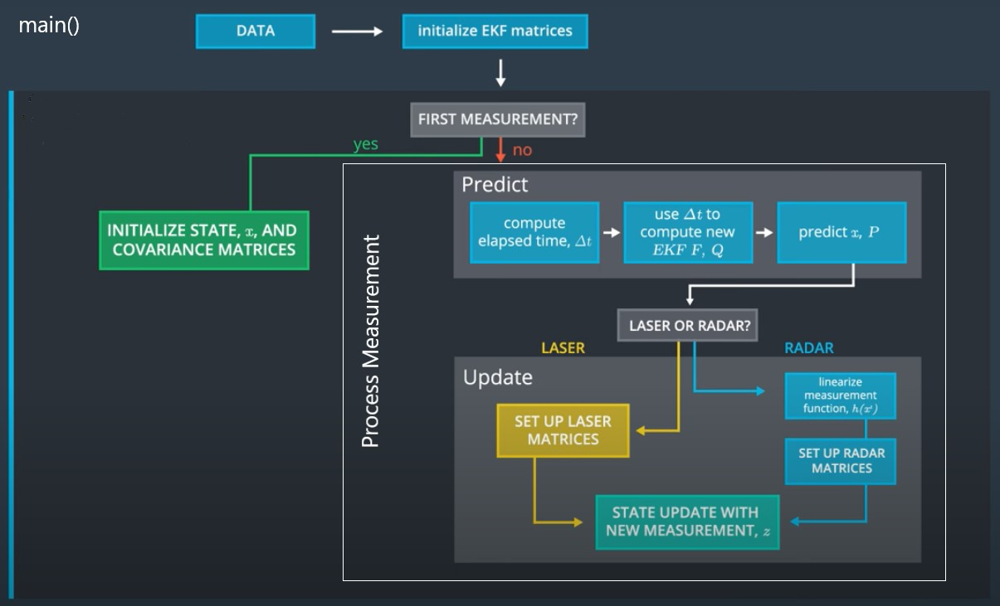

# Extended Kalman Filter Project
Self-Driving Car Engineer Nanodegree Program
---
## Description

Implementation of the Extended Kalman Filter based on sensor data from both LIDAR and RADAR measurements for estimatetion of the state of a moving object.
The project starter code was given [here](https://github.com/udacity/CarND-Extended-Kalman-Filter-Project) and it was completely written in the object oriented programming style. 
However, whole source code was re-arranged in order to make it:
* More re-usable
* More testable (unit test)

All initial-given source codes were modified, except `json.hpp` file. 

---
## EKF Algorithm

EKF is implemented in according to below diagram given by Udacity and all source codes are in [src](/src) folder.

---
## Project Dependencies

* cmake >= 3.5
  * All OSes: [click here for installation instructions](https://cmake.org/install/)
* make >= 4.1 (Linux, Mac), 3.81 (Windows)
  * Linux: make is installed by default on most Linux distros
  * Mac: [install Xcode command line tools to get make](https://developer.apple.com/xcode/features/)
  * Windows: [Click here for installation instructions](http://gnuwin32.sourceforge.net/packages/make.htm)
* gcc/g++ >= 5.4
  * Linux: gcc / g++ is installed by default on most Linux distros
  * Mac: same deal as make - [install Xcode command line tools](https://developer.apple.com/xcode/features/)
  * Windows: recommend using [MinGW](http://www.mingw.org/)
* boost.test >= 1.45 (optional)

## Basic Build Instructions

1. Clone this repo.
2. Make a build directory: `mkdir build && cd build`
3. Compile: `cmake .. && make` 
   * On windows, you may need to run: `cmake .. -G "Unix Makefiles" && make`
4. Run it: `./ExtendedKF `

After built and run `./ExtendedKF `, the Udacity's "Car Simulator" needs to be run to see how EKF works. 
`ExtendedKF ` application connects to the car simulator through [uWebSocket](https://github.com/uNetworking/uWebSockets) to exchange a sensor data.

## Code Style

[Google's C++ style guide](https://google.github.io/styleguide/cppguide.html).

## Unit test

Unit test's performed using [Boost Test Library](https://www.boost.org/doc/libs/1_45_0/libs/test/doc/html/index.html). Example simple test cases are created in `test_case.cpp` file. It can be compiled using `Boost.UTF` library, but it is not mandatory for the project.
It was used to carry out the unit test for `Predict(...)` and `Update(...)` functions in `kalman_filter.h`.

## Project Rubric (RMSE)

The following numbers are final results for each case and as shown below, it satisfied requirements of the project rubric.

### Dataset 1 

RMSE for both LIDAR and RADAR.
* X	: 0.0975
* Y	: 0.0855
* VX	: 0.4460
* VY	: 0.4455

### Dataset 2

RMSE for both LIDAR and RADAR.
* X	: 0.0726
* Y	: 0.0967
* VX	: 0.4518
* VY	: 0.4839

For Dataset 1, additional expirements have been performed by disabling LIDAR or RADAR measurements. When only one of both sensors is enabled, its RMSE accuracy dropped and LIDAR's accuracy was much better than RADAR's.

RMSE for only LIDAR.
* X	: 0.1474
* Y	: 0.1154
* VX	: 0.6294
* VY	: 0.5346

RMSE for only RADAR.
* X	: 0.2296
* Y	: 0.3467
* VX	: 0.5743
* VY	: 0.8054
